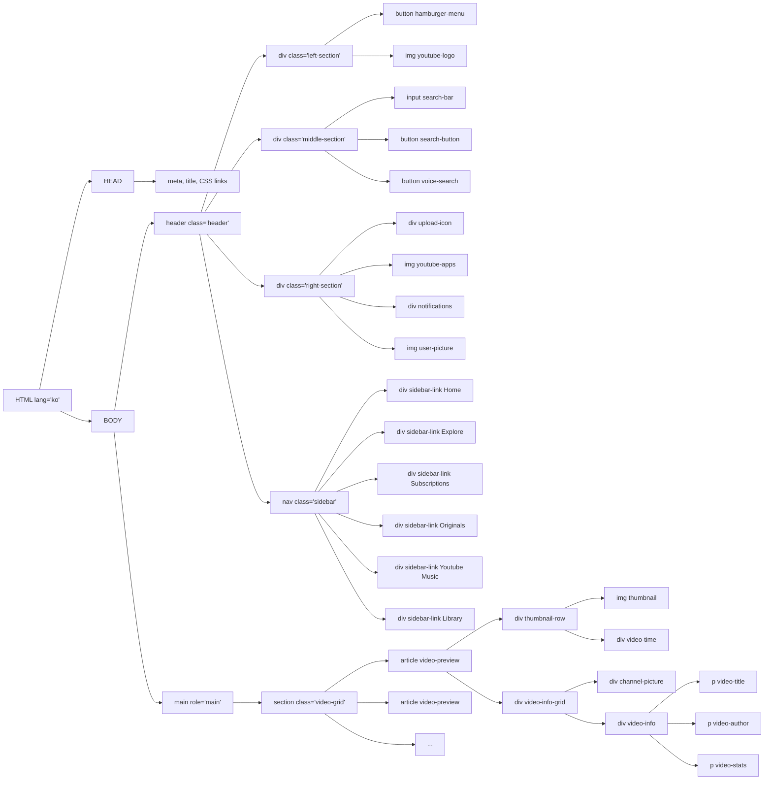

# 1. 유튜브 사이트 목업 화면설계서


## 1. 개요

YouTube Clone 프로젝트는 YouTube 메인 페이지의 사용자 인터페이스를 클론하여 구현한 웹 애플리케이션으로, 비디오 목록 표시와 네비게이션, 검색창 UI 기능을 구현하였습니다.

## 2. 화면구조

- 유튜브 사이트 목업 이미지

    

### 2.1 헤더 영역

사용자가 원하는 콘텐츠를 탐색하거나 검색할 수 있도록 돕는 상단 고정 네비게이션 바입니 다. 검색기능과 주요 사용자 인터랙션(업로드, 알림, 마이페이지 이동 등)에 빠르게 접근할 수 있도록 구성합니다.

| 구분 | 구성요소 | 설명 | hover 시 툴팁 표시 |
| --- | --- | --- | --- |
| 좌측 세션 | 햄버거 모양 메뉴 | 사이드 네비게이션을 열기 위한 버튼 | X |
|  | Youtube 로고 (홈 링크) | 홈 링크로 연결되는 로고 이미지 | X |
| 중앙세션 | 검색창 | 사용자가 키워드로 입력할 수 있는 input 필드 | X |
|  | 검색 버튼(돋보기 아이콘) | 클릭 시 검색 실행 | O |
|  | 음성 검색 버튼 | 음성으로 검색 실행 | O |
| 우측 세션 | 업로드 버튼 | 동영상 업로드 기능 접근 버튼 | O |
|  | 앱 메뉴 버튼 | 유튜브 관련 서비스 버튼 | X |
|  | 알림 버튼(알림 카운트 표시) | 새 알림 수를 표시 | X |
|  | 사용자 프로필 이미지 | 사용자 계정 메뉴 접근 | X |

### 2.2 사이드 바 영역

사이드 바는 화면 왼쪽에 고정된 72px 너비의 미니 사이드 바이며, 주요 메뉴를 아이콘 중심으로 수직 배치하여 빠른 접근을 지원합니다.

| 항목 | 설명 |  |  |  |
| --- | --- | --- | --- | --- |
| 구성방식 | 아이콘 + 텍스트 수직 정렬(flex-column) |  |  |  |
| 너비 | 72px |  |  |  |
| 배경색 | #212121 |  |  |  |
| 메뉴항목 | Home, Explore, Subscriptions, Originals, YouTube Music, Library |  |  |  |
| 호버효과 | 배경색 #4d4d4d로 변경 |  |  |  |

### 2.3 메인 콘텐츠 영역

사용자의 화면 크기에 따라 영상 목록이 유동적으로 배치되도록 비디오 그리드 레이아웃을 사용하여 메인 콘텐츠 영역을 설계합니다.

| 항목 | 설명 |
| --- | --- |
| 구성요소 | 썸네일, 영상 길이, 채널 이미지, 제목, 채널명, 조회수/업로드 시간 |
| 레이아웃 | grid 사용 |
| 반응형 구조 | ~ 750px : 2열 |
|  | 751 ~ 999px : 3열 |
|  | 1000px ~ : 4열 |
| 썸네일 너비 | 100% 카드 너비 |

## 3. 상세 스펙

### 3.1 레이아웃

전체 레이아웃은 Flexbox와 Grid 시스템을 조합하여 구현되었으며, 사이드바와 헤더의 위치를 고정하여 UI일관성을 유지합니다.

| 항목 | 값 |
| --- | --- |
| 사이드 바 너비 | 72px |
| 헤더 높이 | 55px |
| 반응형 적용 | media query로 화면 크기에 따라 자동 적용 |

### 3.2 타이포그래피

기본 폰트는 Roboto 이면, 비디오 제목은 14px, 보조 정보(채널명, 조회수)는 12px로 구성되어 있습니다.

### 3.3 색상규격

전체 테마는 다트 모드 기준으로 설정되어 있습니다.

| 항목 | 색상 코드 |
| --- | --- |
| 바디 배경 | #181818 |
| 기본 텍스트 | white |
| 보조 텍스트 | #AAAAAA |
| 사이드바/헤더 배경 | #212121 |
| 호버 배경(툴팁 배경) | #4d4d4d, gray |

### 3.4 상호작용

각종 버튼과 비디오 카드에 마우스 호버 시 색상 변화나 툴팁이 표시되며, 알림버튼은 카운트 뱃지가 표시됩니다.

| 항목 | 상호작용 |
| --- | --- |
| 버튼 | hover 시 배경색 변경, 툴팁(.tooltip)표시 |
| 알림 | .notifications-count 로 뱃지 표시 |

## 4. 접근성

어두운 화면에 밝은 텍스트를 사용하여 충분한 색상 대비를 제공하며, 기본적인 HTML 구조를 통해서 일부분 영역에 키보드 네비게이션이 가능하도록 구성되어 있습니다.

## 5. 기술스택

본 프로젝트는 HTML5와 CSS3 기반으로 구현되었으며, 기능별 스타일 파일 분리를 통해 유지보수가 용이한 구조로 설계되었습니다.

레이아웃은 Flexbox와 Grid를 활용하여 콘텐츠를 직관적으로 배치하였으며, 다양한 화면 크기에 대응할 수 있도록 반응형 웹 디자인을 적용하였습니다.

또한, 시맨틱 마크업을 사용해 페이지 구조의 명확성을 높이고, 사용자 중심의 콘텐츠 흐름을 구성하였습니다.

## 6. 성능최적화

시맨틱 마크업을 사용하여 HTML구조의 명확성와 유지보수성을 높였으며, 브라우저 렌더링과 접근성 대응에 유리한 구조로 구성했습니다.

## 7. 향후 개선사항

현재는 UI 중심의 구현만 되어 있으며, 검색기능, 동영상재생, 다크모드 전환 등의 기능은 향후 개선할 예정입니다.

# 2. 유튜브 사이트 목업 DOM 트리

## 1. 주요 구성요소

- Header 섹션의 4개 주요 구성요소
- Navigation의 6개 메뉴 항목
- Main 섹션의 비디오 그리드 구조
- 각 비디오 아티클의 상세 구조

## 2. Mermind code



## 3. 유튜브 목업 DOM 트리 이미지

- Left to Right 방향
    
    
    
- Top to Down 방향
    
    
    

# 3. 유튜브 사이트 목업 보고서

## 1. 개요

### 1.1 프로젝트 목적

- YouTube 메인 페이지 클론 구현
    - 현 유튜브의 MVP는 "사용자가 비디오를 업로드하고, 재생하고, 공유할 수 있는 비디오 플랫폼”
    - 다양한 디바이스에서  서비스를 이용할 수 있으며 반응형 대응 경험을 할 수 있습니다.
- 시맨틱 태그를 활용한 웹 표준 준수
    - 아래 w3c를 활용한 웹표준 검사 서비스 이용하여 부적절한 속성 혹은 가이드를 지원 받을 수 있습니다.
    
    [The W3C Markup Validation Service](https://validator.w3.org/)
    
- 웹 접근성 향상
    - chrome devtool 기반 lighthouse로 개선점 모색
    - SEO를 위한 meta 정보 추가 및 필요 시 `sitemap.xml` 를 활용하여 검색 엔진이 사이트를 빠르고 정확하게 인덱싱하도록 돕는 도구를 활용하여 접근성을 높일 수 있습니다.

### 1.2 개선 범위

- HTML 구조의 시맨틱 마크업 강화
    
    > 💡 시맨틱 구조 개선의 장점 
    > 1. 검색엔진이 웹페이지의 내용을 더 정확히 이해하고 인덱싱할 수 있게 해주는 핵심 SEO 요소 중 하나 > SEO가 좋을수록 상단 노출 > 사용자에게 노출 수 증가 > 신규 사용자 유입에 도움이 됩니다.
    > 2. 유지보수를 보다 수월하게 진행 할 수 있습니다. 헤더에 신규 기능이 추가된다고 가정한다면 `<header>`를 찾아 빠르게 진행 할 수 있습니다.
    
- ARIA 속성 추가
    
    > 
    웹 서비스는 남녀노소 특정 하지 않고 모두에게 전달 되는 서비스임으로 스크린리더를 사용하는 사용자 입장에서 도움을 제공 받기 위한 속성이며 많은 기업에서 중요도 높게 작업을 하고 있습니다.  아래 통계 및 영상에 따라 중요도를 알립니다.
    
    </aside>
    
    [WebAIM Screen Reader User Survey 10](https://www.webaxe.org/webaim-screen-reader-user-survey-10/?utm_source=chatgpt.com)
    
    https://www.youtube.com/watch?v=_GwTZnhLcDI
    

## 2. 코드 구조 개선사항

### 2.1 기본 HTML 구조

```html
<!DOCTYPE html>
<html lang="ko">
<head>
    <meta charset="UTF-8">
    <meta name="viewport" content="width=device-width, initial-scale=1.0">
    <meta name="description" content="YouTube clone project">
    <!-- CSS 파일 분리로 유지보수성 향상 -->
    <link rel="stylesheet" href="styles/general.css"/>
    <link rel="stylesheet" href="styles/header.css"/>
    <link rel="stylesheet" href="styles/video.css">
    <link rel="stylesheet" href="styles/sidebar.css">
</head>

```

### 2.2 주요 개선사항 상세

### 2.2.1 헤더 섹션 개선

```html
<header class="header" role="banner">
    <!-- 좌측 섹션 -->
    <div class="left-section">
        <button aria-label="메인 메뉴" class="hamburger-menu">
            
        </button>
        <a href="/" aria-label="YouTube 홈">
            
        </a>
    </div>

    <!-- 검색 섹션 -->
    <form class="middle-section" role="search">
        <input class="search-bar"
               type="search"
               placeholder="검색"
               aria-label="검색">
        <button type="submit"
                class="search-button"
                aria-label="검색하기">
            
        </button>
    </form>

```

### 2.2.2 네비게이션 개선

```html
<nav class="sidebar" aria-label="메인 메뉴">
    <ul class="sidebar-list">
        <li class="sidebar-item">
            <a href="/" class="sidebar-link">
                
                <span>홈</span>
            </a>
        </li>
        <!-- 추가 메뉴 항목 -->
    </ul>
</nav>
```

### 2.2.3 메인 콘텐츠 영역 개선

```html
<main role="main">
    <section class="video-grid" aria-label="비디오 목록">
        <article class="video-preview">
            <figure class="thumbnail-row">
                
                <figcaption class="video-time">8:22</figcaption>
            </figure>
            <!-- 비디오 정보 -->
        </article>
    </section>
</main>
```

## 3. 주요 개선 포인트

### 3.1 시맨틱 태그 활용

- `<header>`, `<nav>`, `<main>`, `<article>`, `<section>`, `<figure>` 등 적절한 시맨틱 태그 사용
- 콘텐츠의 의미와 구조를 명확히 표현
    - `<h1> ~ <h6>` 단계별 heading tag를 사용해서 웹페이 전체에 중요단계 표시

### 3.2 웹 접근성 강화

1. ARIA 역할 추가
    - `role="banner"`
    - `role="search"`
    - `role="main"`
    - `role="navigation"`
2. 적절한 aria-label 사용
    - 버튼과 링크의 목적 명시
    - 이미지의 대체 텍스트 제공

### 3.3 구조적 개선

1. 폼 요소 개선
    - `<form>` 태그로 검색 기능 래핑
    - 적절한 input type 사용
2. 리스트 구조화
    - 네비게이션 메뉴를 `<ul>`, `<li>` 구조로 변경
    - 논리적인 콘텐츠 그룹화

## 4. 성능 및 유지보수성 개선

### 4.1 코드 구조화

- 일관된 클래스 명명 규칙
    - CSS 방법론 도입 > 순수 CSS를 사용하는 경우 중복 클래스 명과 우선수위 등 이유로 다양한 스타일 이슈가 발생 할 수 있으며, 이를 해결하기 위한 방법이 필요합니다, `BEM` 방법론을 활용하여 스타일 작업에 도움을 받았습니다.
- CSS 파일 모듈화
    - 이외 방법중 하나로 .module.css 를 활용하여 페이지or 컴포넌트 단위 스타일을 지정하여 스타일 버그를 개선 할 수 있습니다. 현재 순수 css로 프로젝트가 진행 되는 만큼 적용은 개선점으로 가져가야합니다.

### 4.2 성능 최적화

- 이미지 최적화 (WebP 형식 사용)
    
    
    | 포맷 | 압축 방식 | 투명도 지원 | 애니메이션 지원 | 색상 수 | 특징 |
    | --- | --- | --- | --- | --- | --- |
    | **JPG/JPEG** | 손실 압축 (Lossy) | ❌ | ❌ | 1,670만 색상 (24bit) | 사진에 적합, 파일 크기 작음, 품질 저하 가능 |
    | **PNG** | 무손실 압축 (Lossless) | ✅ (알파 채널) | ❌ | 1,670만 색상 (24bit) | 투명한 배경 지원, 아이콘/로고/UI에 적합 |
    | **GIF** | 무손실 압축 (Lossless) | ✅ (1비트) | ✅ | 256 색상 (8bit) | 애니메이션 가능, 투명도는 단일 색만 가능 |
    | **WebP** | 손실 및 무손실 모두 지원 | ✅ | ✅ | 1,670만 색상 (24bit) | 고효율 압축, 현대적 웹 이미지 포맷, 브라우저 호환성 점검 필요 |
- CSS 최적화
    - 보통 CSS문서에서 사이트 구축을 할 때나, 유지보수 작업을 하다보면 여러 곳을 임의로 바꿔야하고, 공통적으로 들어가는 부분들이 있습니다.CSS에서 이를 간단하게 변수를 선언하여 사용하면 좀 더 쉽게 작업을 할 수 있게 하기위한 `:root` 의사 클래스 방법을 활용 해봅시다.
- 시맨틱 마크업으로 SEO 개선

## 5. 향후 개선 계획

### 5.1 단계 개선사항

- 추가 ARIA 속성 구현
- 키보드 네비게이션 개선
    - 키보드 `tap`  키를 사용한 `:focuse`  이동을 사용자에게 전달하여 현재 active 상태에 요소를 안내할 필요가 있습니다.
- 반응형 디자인 보완
    - 아이폰se: 375px, ipad-mini: 768px, pc: 1440px 등 디바이스별 사이즈 차이로 인한 디자인을 활용하여 레이아웃을 수정해야 합니다.
- 엣지케이스 보안
    - 404 router, 검색어에 맞는 영상이 없는경우 등 웹페이지를 사용하다 보면 겪을 수 있는 상황에 맞는 대응처리가 필요합니다.

### 5.2 장기 개선사항

- JavaScript 기능 추가
    - 정적인 웹페이지에 사용자 인터렉션(클릭이벤트, 좋아요 기능, 테마변경 등)을 위한 이벤트 연결을 추가하여 웹페이지 정적을 동적인 요소를 추가 할 수 있습니다.
- 다국어 지원
    - Youtube 서비스는 전세계적으로 이용하는 서비스이며 이를 해결하기 위해선 다국어 서비스를 지원해야 합니다. 합리적인 선택방법으론 `i18n`  라이브러리에 도움을 받을 수 있습니다.
        
        [Introduction | i18next documentation](https://www.i18next.com/?utm_source=chatgpt.com)
        
- 다크 모드 구현

## 6. 결론

시맨틱 태그와 웹 접근성을 고려한 구조 개선으로 더 나은 사용자 경험과 유지보수성을 확보했습니다. 지속적인 개선을 통해 웹 표준을 준수하는 고품질 웹 서비스를 제공할 수 있을 것으로 기대됩니다.